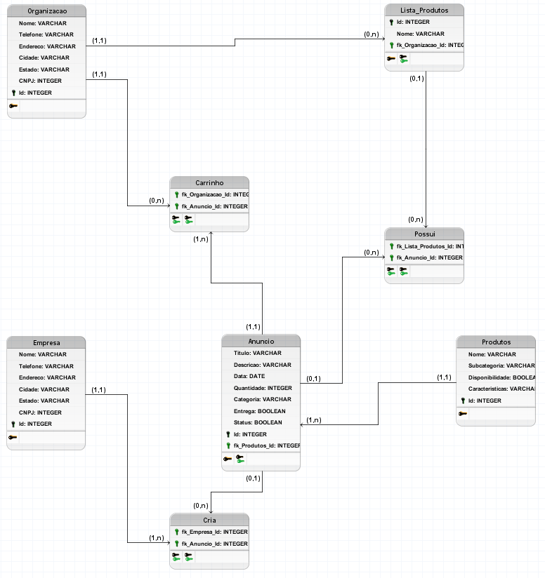

# Marketplace Java

## Introdução

Olá, este é meu projeto de marketplace desenvolvido inteiramente em java e com algumas praticas de orientação a objetos em mente.
Este projeto foi totalmente desenvolvido para banco de dados, portanto para garantir que o mesmo funcione corretamente é importante possuir um servidor sql no ambiente de execução, bem como
o plugin connector/J

## Estrutura de pastas

Este projeto possui três pastas principais, 
 - `bin`: A pasta bin é onde ficam os arquivos java compilados e executaveis
 - `lib`: Nesta pasta as dependencias podem ser armazenadas, nota: Este projeto não faz uso de nenhuma dependencia
 - `src`: Aqui é onde o codigo fonte desenvolvido está guardado

Este projeto foi desenvolvido utilizando o java para visual studio code, portanto sua execução é facilitada por ele, entretanto a execução deste software pode ser realizada
partindo da compilação do arquivo denominado **App.java**

## Arquitetura

Esta aplicação foi desenvolvida com o Padrão DAO(Data Access Object) um padrão desenvolvido para aplicações com persistencia de dados em mente, aqui as regras de negocio e
as regras de acesso são separadas em dois pacotes diferentes, os pacotes BEAN e DAO, ainda, há um pacote que possui todas as configurações e definições com intuito de facilitar a conexão com o banco de dados chamado Factory. 

## Conexão com banco de dados

Devido a arquitetura implementada todas as configurações necessarias para se conectar a uma base de dados podem ser verificadas no arquivo **ConexaoFactory.java dentro do pacote Factory**.
Por padrão as configurações para acesso ao banco de dados são:
 - `Endereço`: jdbc:mysql://127.0.0.1:3306/marketplace
 - `Usuario`: java
 - `senha`: java123

É possivel testar a conexão com o banco de dados, para isso execute o programa dentro da pasta Test, caso o programa retorne **tudo funcionando com o banco de dados!** significa que conexão funciona perfeitamente e a aplicação ja pode ser executada

Lembrando que para ser realizada a conexão é necessario a biblioteca **Connector/J**, bem como um servidor com sql instalado na maquina de execução

 ## Configurações do banco de dados

Para conseguir executar a aplicação de maneira esperada é importante possuir uma base de dados com todas as tabelas,chaves primarias e estrangeiras bem definidas, pensando nisso
é possivel encontrar dentro da pasta src um arquivo chamado marketplace.sql, este arquivo é um dump sql com o modelo fisico da base de dados desenvolvida para a aplicação, este arquivo
pode ser importado por atraves de um sgbd para adicionar todas essas informações necessarias para o software poder ser utilizado. Abaixo há uma imagem com o modelo logico desenvolvido
para a aplicação.

## Para saber mais
Caso tenha ficado com alguma duvida pode entrar em contato comigo por aqui pelo github🐱 ou então pode assistir ao video feito que mostra sobre os topicos comentados acima, além de demonstrar
como é o funcionamento da aplicação e algumas outras coisas, o link para o video está logo abaixo.

[video sobre a aplicação]()